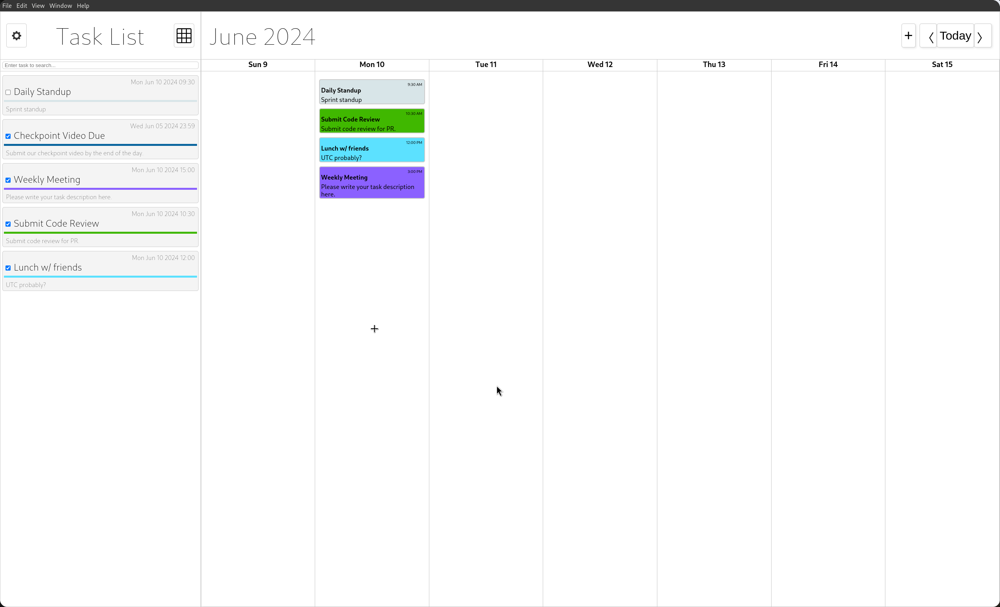
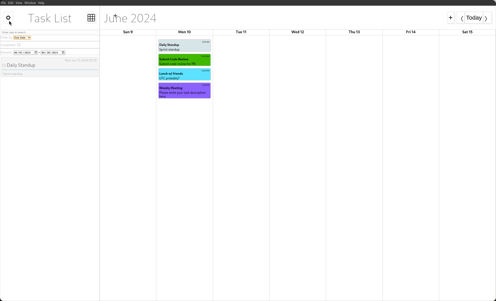
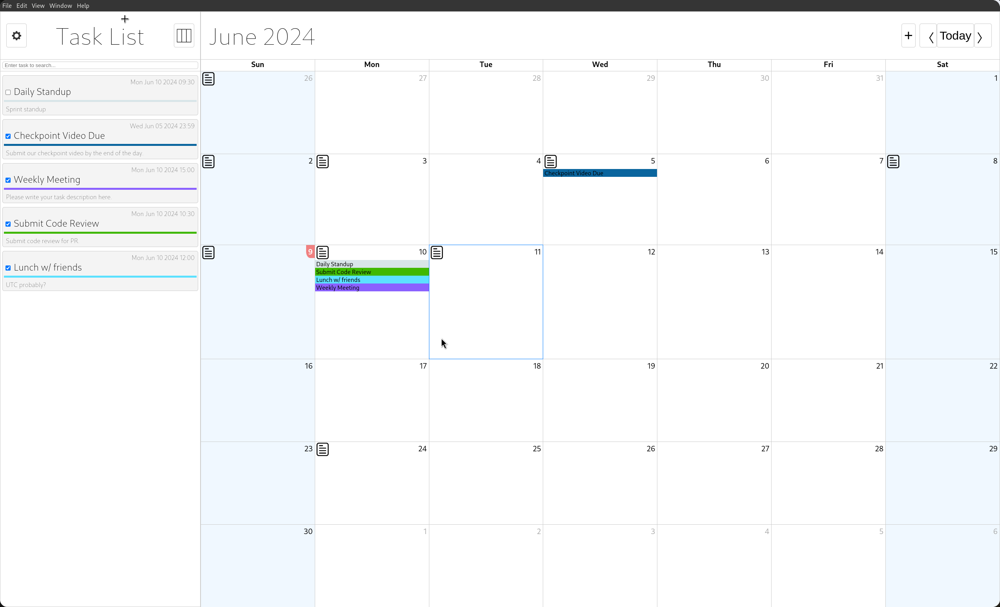
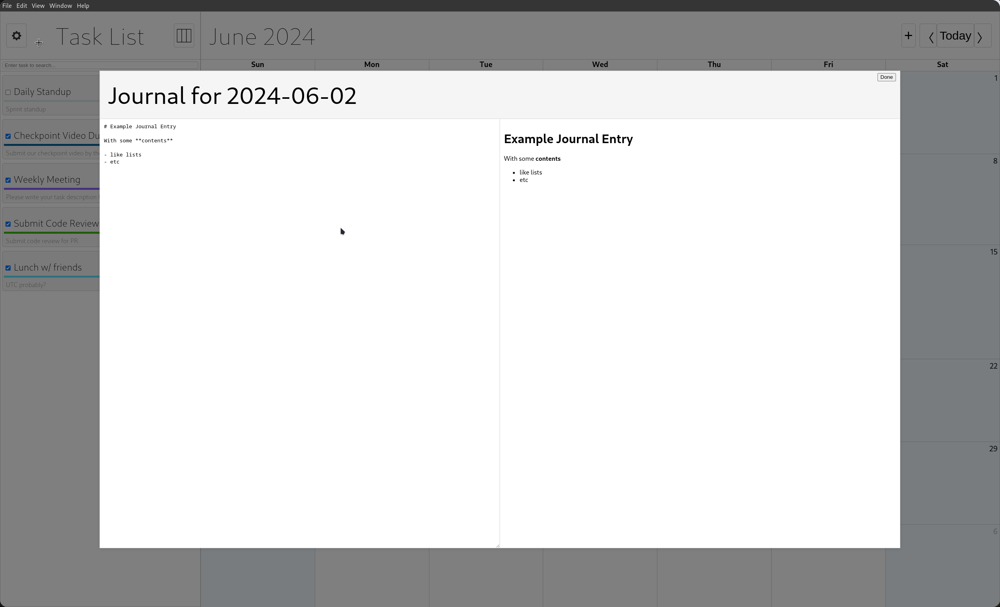
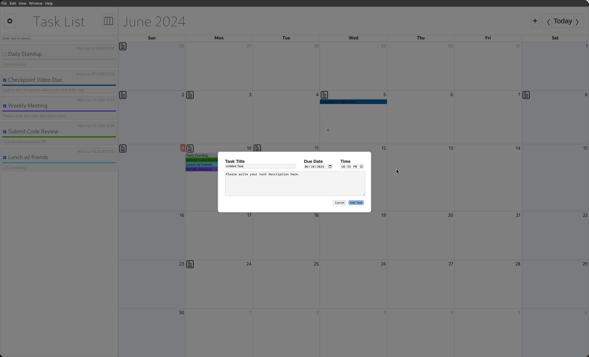
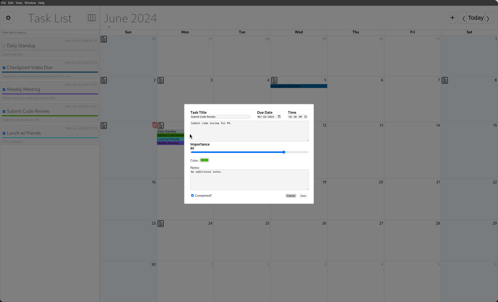
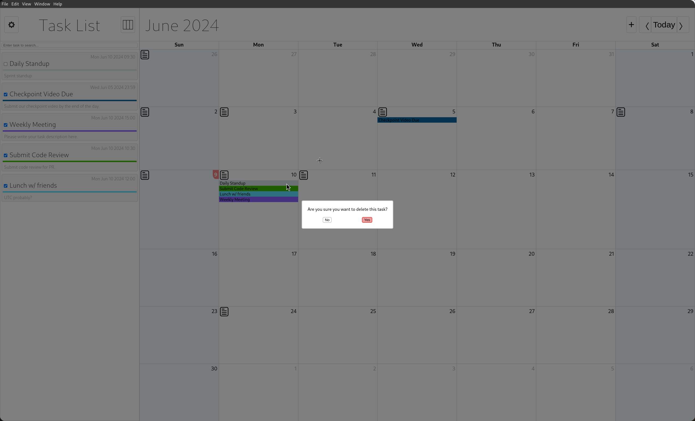

# cse110-sp24-group16

## Team 16 (Quantuum Leap)

GitHub repo link: [https://github.com/cse110-sp24-group16/cse110-sp24-group16/](https://github.com/cse110-sp24-group16/cse110-sp24-group16/)

[Team Info](./admin/team.md)

[DEVLOG (all changes and progress made, chronologically)](https://github.com/cse110-sp24-group16/cse110-sp24-group16/wiki)

[Documentation (autogenerated)](https://cse110-sp24-group16.github.io/cse110-sp24-group16/out/index.html)

[HTML version of readme and all links](https://cse110-sp24-group16.github.io/cse110-sp24-group16/)

How to run:

`npm start` launches the electron app

CI/CD Pipeline:

- Linter: ESLint, Codacy
  - Check code for proper linting with `npm run lint` in project root.
  - Part of `ci.yml`, which runs on every pull request. Ensures that formatting and syntax is up to standards. Codacy just has its own linter in-build which reports errors if there are any.
- External code quality analysis: Codacy
  - Provides information about bad, harmful, or insecure code. Dashboard link: [CODACY](https://app.codacy.com/gh/cse110-sp24-group16/cse110-sp24-group16/dashboard)
- Human review: Protected `main` and `dev` branches
  - First, you have to PR to `dev` branch and it requires code review from 1 person. Please assign several people when creating a PR.
  - Then, after PR to `dev` has been approved and merged, changes will be validated on `dev` and PR'ed into `main` after review from at least 2 people.
- Unit testing: Jest and Mocha
  - Automatically done on push and PR via automations.
  - Can test code locally using `npm run test` in project root.
- Code coverage: istanbul, nyc
  - Use nyc as part of testing command in npm to automatically generate code coverage report.
  - The report is then uploaded to codacy during PR with an automation.
- Documentation & autogeneration: JSDoc
  - Document all your code according to JSDoc format.
  - Automatically converts comments into documentation on push/PR.
  - Can locally update documentation with `npm run jsdoc` in project root.
  - Documentation output is in `out/` directory.
  - On PR, `jsdoc.yml` updates the documentation and pushes it to repo.
- e2e testing: WebDriverIO
  - On PR, `npm run wdio` will run e2e tests and report the results for each module.
  - We have e2e tests for each element user can interact with.
- Manual Testing:
  - Test product by hand, publish reports below.
  - [Manual Testing Report](./source/__tests__/060824-Manual-Testing-Report.md)

Project status and work:

- Tasks: GH Projects and Issues
  - All active and planned tasks can be found in this repository issues and project section with assigned people, tasks description, and completion status.
- Daily standups: Standuply
  - App integration with Slack to conduct standup polls on daily basis, results are posted in a public channel so that everyone can evaluate the work done.
- Tags: Automations
  - If interested in only specific updates (e.g., frontend or CSS), use tags in your search. They are both automatically and manually assigned to every Issue and PR.

### Automatic code evaluation scores

### Application usage

Weekly task-list view is the main thing user sees when they launch the app.

View all upcoming tasks, add new events, check out neighbouring weeks.

Sidebar feature is very useful to see nearest deadline and incomplete tasks as a list.

User has options on what parameter to sort tasks on the sidebar by: Importance or Due date, can also choose the timeframe for the tasks to show on the taskbar.

User can also transition to monthly view to checkout past completed tasks and make journal entries about their experience.

User can view/add/edit the daily journal for any day from here. If journal icon is clicked on a certain day, the journal interface show up.

From any view user can add, edit, read, or delete the task, i.e. has full CRUD functionality.

Everything is saved automatically.

Enjoy using our app!
