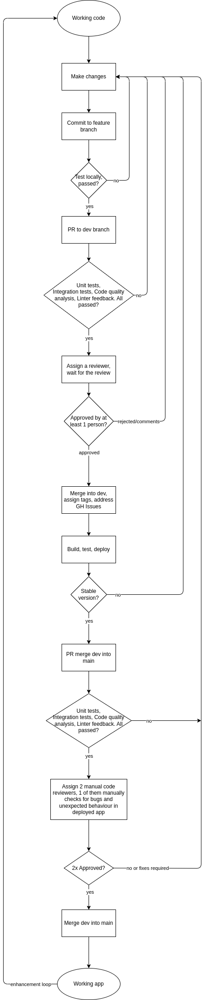

### Comprehensive CI/CD Pipeline Status Report

#### Executive Summary

This report provides a detailed overview of the current state and future plans for our Continuous Integration/Continuous Deployment (CI/CD) pipeline. Our CI/CD process is crucial for maintaining high standards of code quality and ensuring the efficient progression of code from development through to deployment. The attached diagram (Figure 1) visually outlines the systematic steps of our pipeline.

#### Existing CI/CD Features

1. **Linting with ESLint:**

   - **Purpose and Implementation:** ESLint is utilized to enforce consistent coding standards across our project. It is configured to automatically run with the `npm run lint` command within the project root directory.
   - **Impact:** This step ensures that all code adheres to our predefined coding standards, significantly reducing the likelihood of bugs and enhancing code readability.

2. **Code Quality Analysis with Codacy:**

   - **Purpose and Implementation:** Codacy provides an automated way to perform code quality analysis. It reviews code for potential issues, such as security vulnerabilities, code complexity, and duplications.
   - **Impact:** Using Codacy helps us maintain a high standard of code quality and security before changes are merged into our codebase.

3. **Code Review Process:**

   - **Development Branch:** Features and fixes are developed in isolated branches, with changes merged into the `dev` branch via pull requests (PRs). Each PR requires a review and approval by at least one other team member.
   - **Main Branch:** After rigorous testing in the `dev` branch, changes are merged into the `main` branch through a PR, which requires approval from at least two team members.
   - **Impact:** This rigorous review process helps prevent bugs and ensures that all changes meet our standards before they are deployed.

4. **Unit Testing with Jest:**

   - **Purpose and Implementation:** We use Jest for automated unit testing. It runs on every push to any branch and on every PR, triggered by our CI tools. Developers also have the capability to run tests locally using `npm run test`.
   - **Impact:** Automated testing minimizes the risk of bugs reaching production by ensuring that all new code satisfies existing test conditions before integration.

5. **Documentation Generation with JSDoc:**

   - **Purpose and Implementation:** Our project documentation is automatically generated from code comments using JSDoc. This occurs on each push or PR, with the generated documentation stored in the `out/` directory. Developers can update documentation manually with `npm run jsdoc`.
   - **Impact:** Automatically generating documentation ensures our documentation is always up-to-date and accessible, reducing barriers for new developers and enhancing code maintainability.

6. **Manual End-to-End Testing:**
   - **Purpose and Implementation:** Prior to merging PRs into the `main` branch, manual end-to-end testing is conducted to ensure that all parts of the system work together as expected.
   - **Impact:** This testing is crucial for catching issues that unit tests might miss, particularly those involving integrated system behavior.

#### Planned Enhancements and Features

1. **Integration of Codecov.io:**

   - **Purpose:** We plan to integrate Codecov.io to enhance our code coverage insights during unit testing. Codecov.io will provide detailed reports on how well our tests cover our codebase.
   - **Impact:** This will allow us to identify untested parts of our code more efficiently and improve our overall test coverage, leading to a more robust and reliable software product.

2. **Automated End-to-End Testing:**

   - **Purpose:** Automating our end-to-end testing process is a priority to streamline our testing phase and reduce the manual effort required.
   - **Impact:** Automation will speed up our deployment process, decrease the chances for human error, and ensure consistent testing results.

3. **Enhanced Code Review Automation:**

   - **Purpose:** We are exploring advanced tools that can provide automated assistance in the code review process to help identify potential issues more efficiently.
   - **Impact:** This will reduce the time required for code reviews while improving the accuracy and consistency of the review process.

4. **Performance Monitoring Tools:**
   - **Purpose:** We plan to incorporate performance monitoring tools into our pipeline to better understand the real-time performance of our system.
   - **Impact:** This will enable proactive optimization of the system, ensuring high performance under varying loads and conditions.

#### Conclusion

Our CI/CD pipeline is integral to our development process, driving both the quality and speed of our software development lifecycle. The current configuration has proven effective, and with the integration of additional tools like Codecov.io and automated e2e testing, we anticipate further improvements in our workflow efficiency and product reliability.

#### CI/CD Pipeline Diagram

