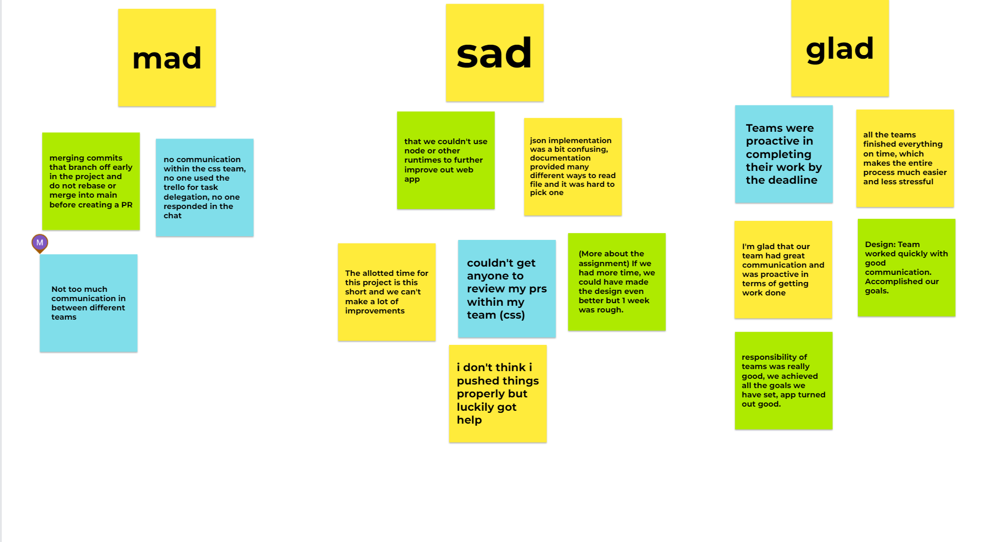
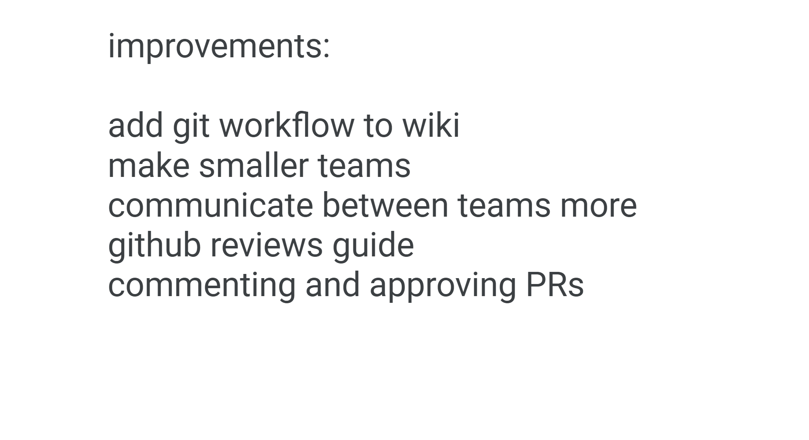

Note Taker: Wilson Sugiarto
# Attendance:
-	Sam, Daniil, Wilson, Jordan, Matthew, Hisham, Andrew, Michelle, Jason
-	Absence: Neelkanth (excused), Jungwoo (excused)
# Agile Retrospective
## Jam Board ScreenShots

-	First part of the meeting was completing the jam board of glad, sad and mad (https://jamboard.google.com/d/1ogp0lCJMZgUCSHzWZg-mq2ykjIgGMoGgtZwXHHlJrPU/viewer?f=0) 
-	Verbally went through the sticky notes on jam board. 
-	We should split groups into smaller groups for closer with one another work 
-	In regards to communication between teams, possible improvement was to have a less serious channel to express opinions on the work of others
-	We should create a git guide to make sure no mistakes are made when it comes to using github
-	We need more people to review PRs and learn how to read and leave useful comments for PRs
-	Json documentation struggles are easily fixable through communication and time after reading
# Other (for future projects):
-	More people should give ideas for what the design should be like before the design team can get to work (use miro/type in general).
-	Create flowcharts for product usage. 
